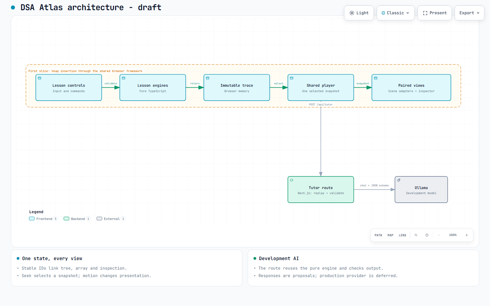
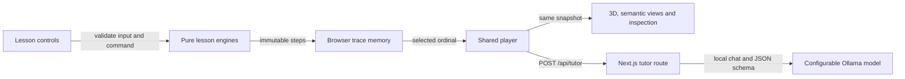
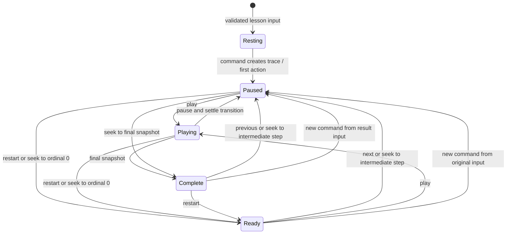

# DSA Atlas - architecture review

**Status:** Accepted 2026-10-05 by @Exilitys.

**Reviewed:** Version 1 at d8b8f34, including the exact HTML and diagram-source
hashes recorded below. The owner's "Continue" accepted the final review packet.

The components below describe the proposed system, not an implemented app.
[Technical specification](../prd/prd.md) defines the interfaces and ownership;
[slice 001](../specs/001-heap-insertion.md) defines the first observable journey.

[Open the interactive diagram](system.html) or use the GitHub-renderable view
below. [Editable diagram source](system.architecture.json).

## Components and flow

The route imports the same pure engine code to reconstruct the selected step.
It validates IDs and commands before returning a correlated response. The
learner previews and applies any accepted command proposal. No response
mutates algorithm state on its own.

The first slice covers the shared browser path using heap insertion. The
complete release also requires extraction, graph BFS/DFS, challenges, and AI.
Local Ollama is a development choice; deployed provider access remains deferred.

## Data and ownership

| Data | Authority | Consumers |
| --- | --- | --- |
| Validated input and immutable snapshots | Lesson engine | Player, every view, inspection, authored learning, and server reconstruction. |
| Selected ordinal | Shared player | All views and current tutor context. |
| Layout and camera | Browser presentation state | Scene adapter only; never traversal order. |
| Authored objectives and challenge answers | Lesson content and deterministic grading | Shared learning UI and local evidence. |
| Tutor explanation/proposal | Server-validated provider result | Tutor UI; Apply creates a validated new run. |

This is the seam that makes reuse concrete: heap and graph engines supply the
reviewed interface, while scene adapters differ. A lesson does not implement
its own playback or network protocol. There is no shared database in P0.

## Player lifecycle

Resting has no active run. Ready is ordinal 0 of an existing run. Paused selects
an intermediate snapshot; Complete selects the final one. Seek interrupts
presentation motion without altering stored data. Heap commands start only
from Ready/Complete. Graph input edits reset traversal into a new validated
scene/run; camera and layout changes stay outside this lifecycle.

## Validation receipt

Archify architecture delivery passed **9/9 showcase checks**, with **0 errors
and 0 warnings**. Automated browser evidence passed at 1440x900, 1600x1000,
1920x1080, and 2048x1320; no horizontal or vertical overflow was measured.
The drafting agent inspected light/dark screenshots at the endpoint sizes;
the default diagram, labels and cards showed no clipping or crossings.
Interactive viewer controls were not manually exercised.

- Diagram specification SHA-256: `42e742d7e90e43ef5dffdfb0e7bf712c54aeff1c80992f43ac47bfdd29ee27ed` (2,623 bytes).
- HTML artifact SHA-256: `ae19b244810c674df6d6a7f4c00bb39002524c408bdc8bd3ce2b935cd13ea9d4` (710,135 bytes).
- [Automated browser receipt](system.visual-check.json).
- [Four screenshot evidence views](system.visual-check.html).

Browser evidence and image review establish the diagram's presentation. They
do not establish application behavior or human acceptance of the design.

## Where to review closely

1. The shared engine interface, including initial entry state and command boundaries.
2. Stable identities through extraction, replay, and paired representations.
3. Tutor reconstruction/cancellation, local Ollama development, and proposed
   numerical guards before production provider selection.

Accept this diagram together with the technical spec and slice 001, or request
changes to those specific parts. Groundwork follows human acceptance.
